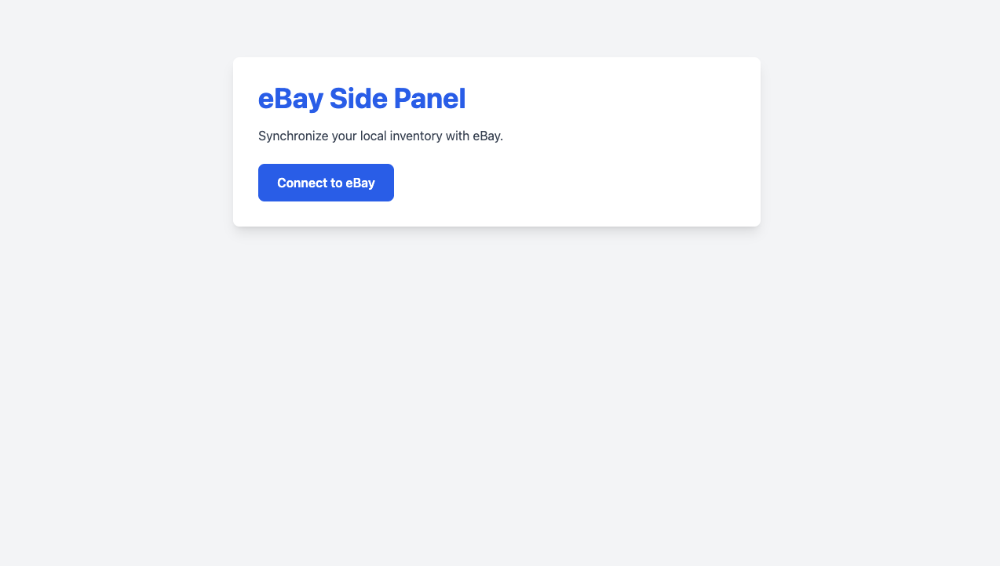
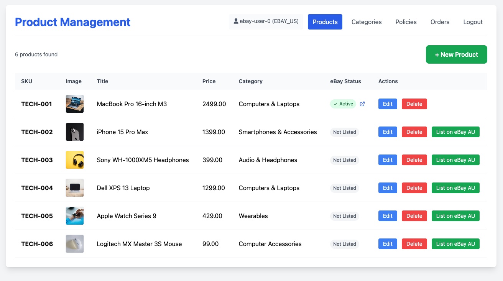
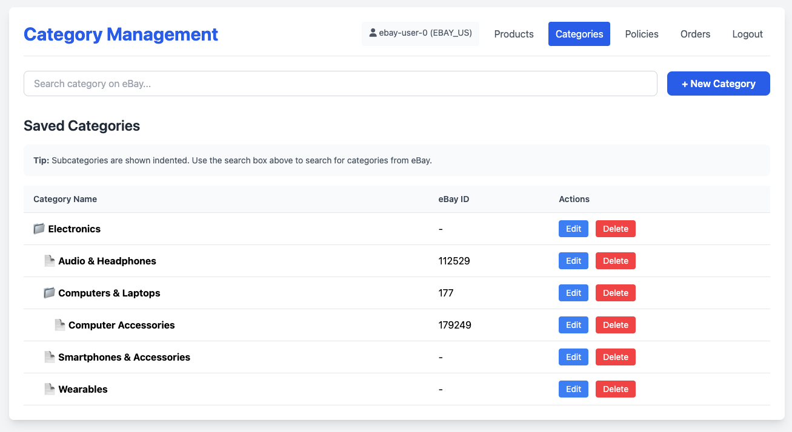
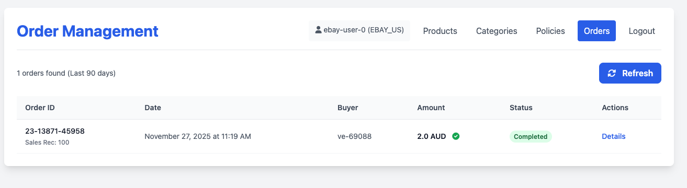
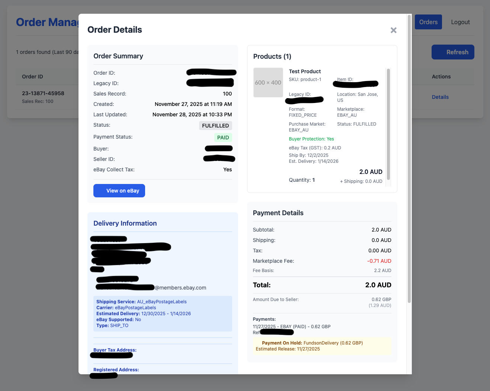
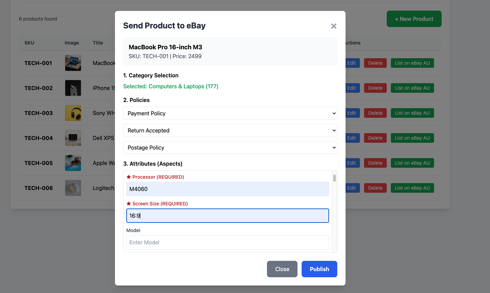
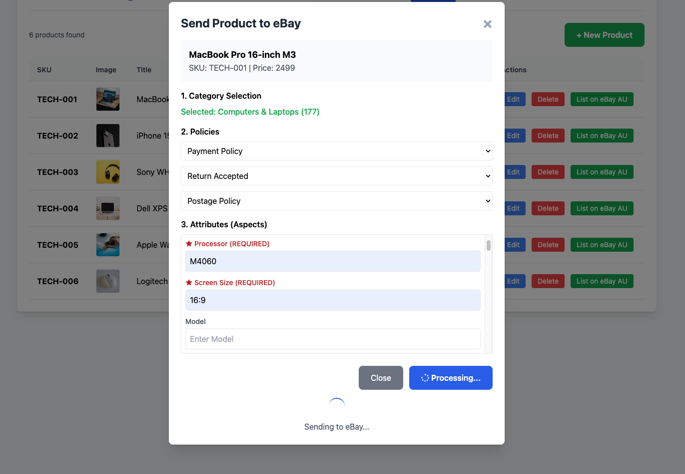

# eBay Side Panel

A lightweight, efficient management panel for synchronizing local product inventory with eBay. Built with Node.js, Express, SQLite, and Vanilla JS/jQuery.

## ⚠️ Important Note Regarding eBay Environment

**Please Note:** The eBay Sandbox environment is known to be unstable and often fails to function correctly for various API calls, particularly those related to policy management and inventory creation.

**Recommendation:** For the most reliable testing and development experience, it is strongly recommended to perform simple, controlled tests in the **Production** environment. To avoid unintended sales, you can:
- Create test listings with significantly high prices.
- Set inventory quantity to 1.
- End listings immediately after testing.

## Features

- **Product Management:** Manage your local inventory with support for images, categories, and detailed descriptions.
- **eBay Integration:**
  - **OAuth 2.0 Authentication:** Securely connect your eBay account.
  - **Inventory Sync:** Push local products to eBay inventory.
  - **Offer Publishing:** Create and publish offers directly to eBay.
  - **Policy Management:** View, create, edit, and delete Shipping, Payment, and Return policies.
- **Order Management:** View and manage your eBay orders (supports last 90 days).
- **Category Management:** Import categories directly from eBay or manage local category trees.
- **Multi-Marketplace Support:** Architecture designed to support multiple eBay marketplaces (currently optimized for EBAY_AU).

## Screenshots

### Login Page


### Products Management


### Categories Management


### Orders Overview


### Order Details


### Sending Product to eBay


### Publishing Product on eBay


## Prerequisites

- Node.js (v14 or higher)
- npm (Node Package Manager)
- An eBay Developer Account (for API keys)

## Setup & Installation

1.  **Clone the repository:**
    ```bash
    git clone <repository-url>
    cd ebay-side-panel
    ```

2.  **Install dependencies:**
    ```bash
    npm install
    ```

3.  **Environment Configuration:**
    Create a `.env` file in the root directory with the following variables:
    ```env
    PORT=8080
    SESSION_SECRET=your_session_secret_key
    EBAY_CLIENT_ID=your_ebay_client_id
    EBAY_CLIENT_SECRET=your_ebay_client_secret
    EBAY_RU_NAME=your_ebay_redirect_uri_name
    EBAY_ENV=PRODUCTION  # Set to SANDBOX only if you are sure
    ```

4.  **Run the Application:**
    ```bash
    npm start
    ```
    The server will start on `http://localhost:8080`.

## Usage

1.  Open your browser and navigate to `http://localhost:8080`.
2.  Click "Login with eBay" to authenticate.
3.  Use the navigation menu to access Products, Categories, Policies, and Orders.

## Project Structure

- `server.js`: Main Express server handling API endpoints and database logic.
- `public/`: Frontend assets including HTML pages, CSS, and client-side JavaScript.
- `db/`: Directory containing the SQLite database file (`app.db`).

## Technologies Used

- **Backend:** Node.js, Express.js
- **Database:** SQLite3
- **Frontend:** HTML5, CSS3 (Tailwind CSS via CDN), JavaScript (jQuery)
- **API:** eBay REST APIs (Inventory, Fulfillment, Account, Taxonomy)
